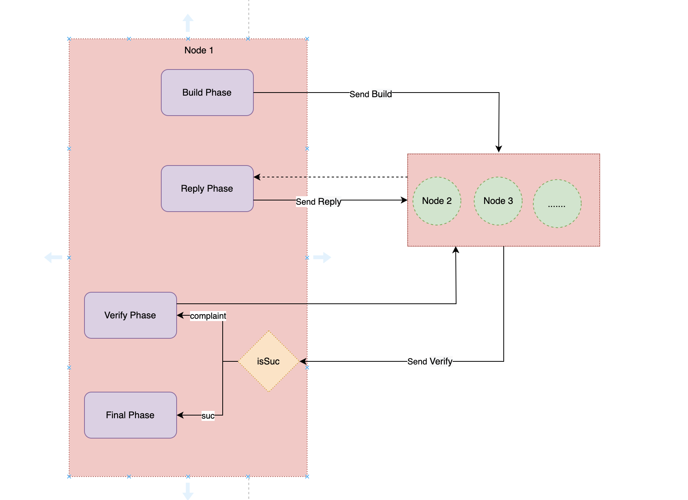
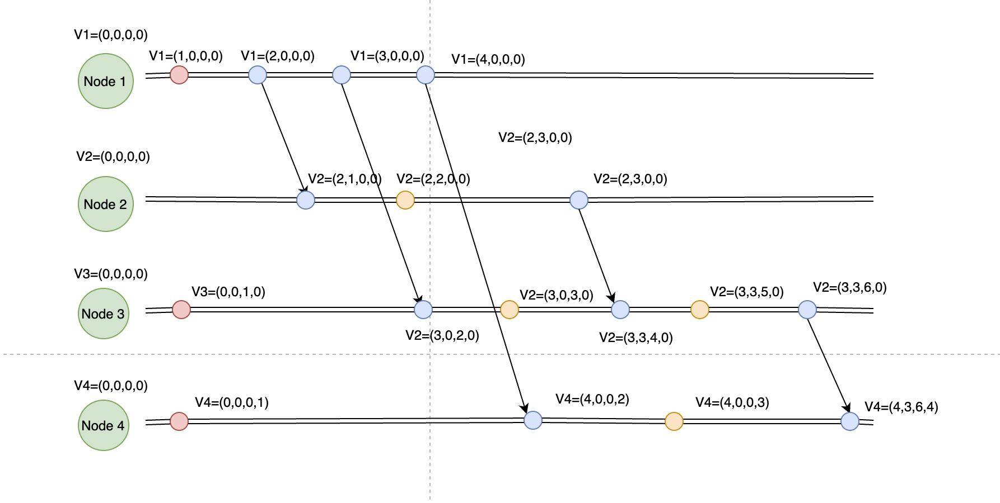

## Proposal Overview

### VLC & BLS Proposal
Randomness serves a vital role in nearly every aspect of current society，the idea is to intergrate the ablility of logical clocks into random generator. To generate verifiable, fair random numbers, the proposal integrates BLS.

### Proposal Details
We hope to create a new Random number generation scheme in a completely decentralized network environment，utilizing pairing-based cryptography, t-of-n distributed key generation, and threshold BLS signatures to generate publicly-verifiable, unbiased, unpredictable, distributed randomness.  Integrate with the eventual consistency capability of Hetu logical clocks, without the need for any trusted third parties or consensus algorithms. 

####  DKG

* [ Distributed Key Generation (DKG)](https://en.wikipedia.org/wiki/Distributed_key_generation)

####  BLS

* each participant creates the partial BLS signature
* Once at least t participants have broadcast their partial signatures, anyone can restore the BLS threshold signature
* Vector clock ensures process consistency in each round