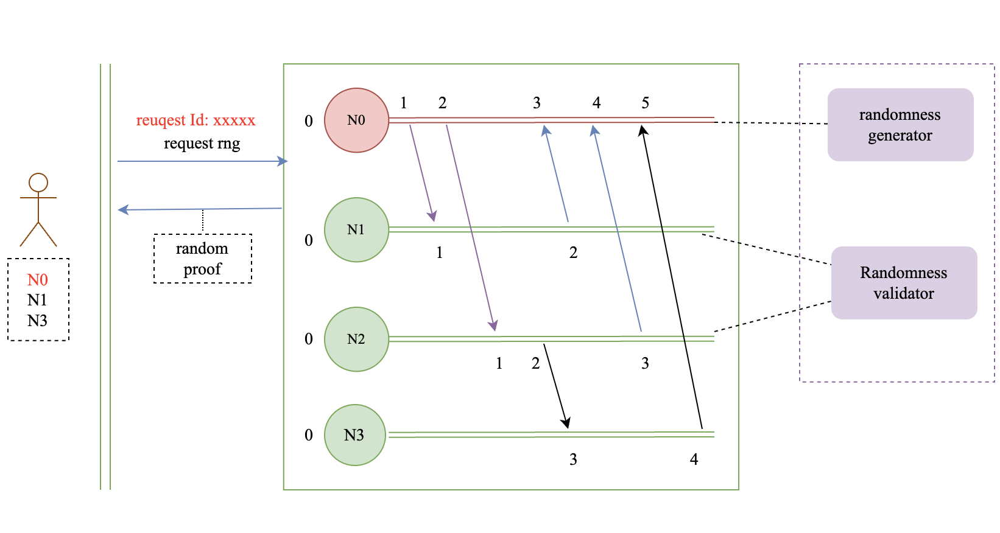

## Proposal Overview

### VLC & VRF Proposal
Randomness serves a vital role in nearly every aspect of current society，the idea is to intergrate the ablility of logical clocks into random generator. To generate verifiable, fair random numbers, the proposal integrates VRF.

### Proposal Details
We hope to create a new Random number generation scheme in a completely decentralized network environment，utilizing the eventual consistency capability of Hetu logical clocks, and integrate VRF that generates an output that can be cryptographically verified as random，without the need for any trusted third parties or consensus algorithms. 

* Each node can act as a randomness generator and randomness validator
* When a randomness has been verified t times and passed, it means that the randomness is valid.

####  Features
Each random number is generated by a random trusted node.
* Decentralized: Each random number will be verified by multiple participants
* UnBiased: No party can lead randomness in any way
* Verifiable: Anyone can verify the legitimacy of the random number based on the proof
* Unpredictable: No one can predict the next random number
* Always available: Anyone can request one or more random numbers at any time

####  Scenarios
This proposal places no restrictions on the generation of random numbers. Anyone can request random numbers at any time. Suitable for gaming, social network, etc.

eg: In a game, multiple players draw random rewards at the same time